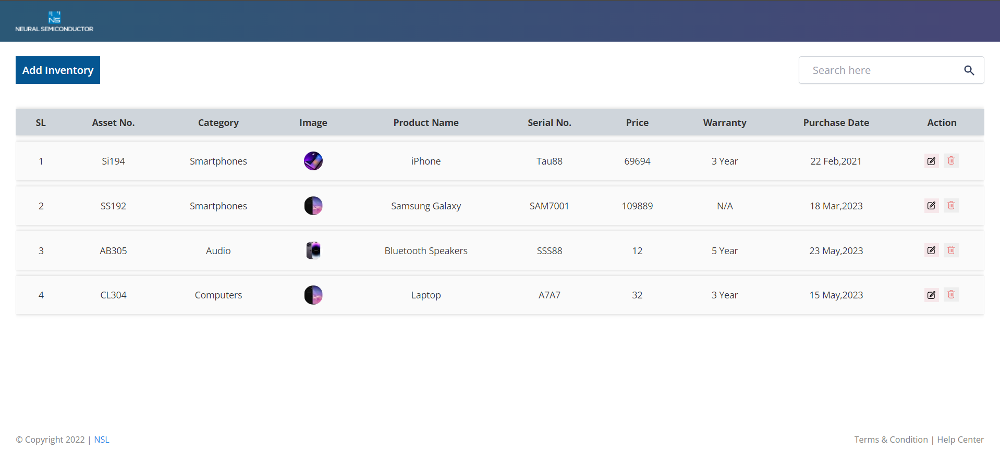
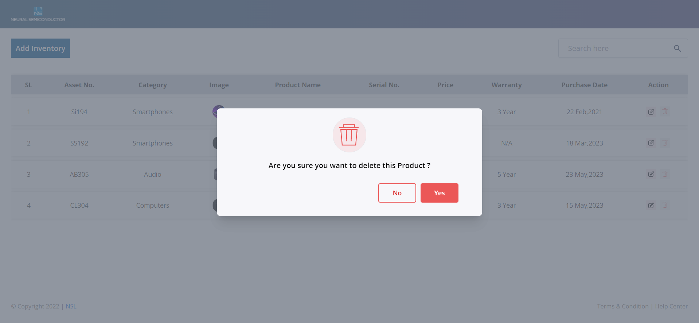
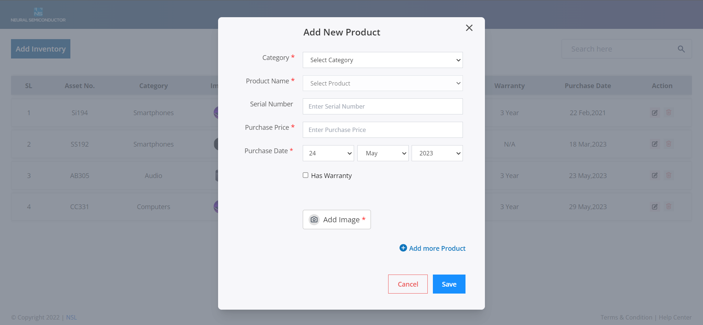
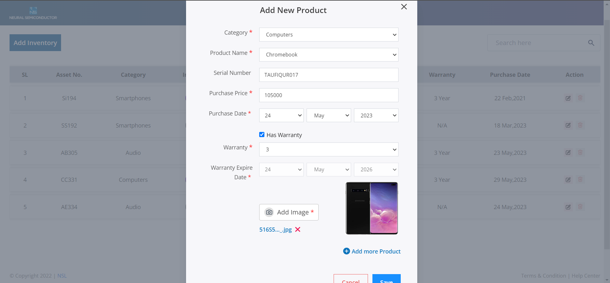

# <p  align="center">NSL-Task 🚀🚀</p>
### Installation 💻

1. Clone the repository

2. Open the terminal from root directory of the project

3. Write this commands

With npm

```bash
> npm install
```

```bash
> npm run dev
```

or yarn

```bash
> yarn
```

```bash
> yarn dev
```
## Screenshots






### Tech 🚀🚀

1. JavaScript

2. React.js

3. CSS

4. Tailwind CSS

<p  align="center"  bold> </p>
# NSL Task
